# KikoPlay 脚本 TMDb & TVmazeList - 使用手册

脚本 TMDb (`/library/tmdb.lua`) 是用于弹幕视频播放软件  [KikoPlay](https://github.com/KikoPlayProject/KikoPlay) 的资料脚本，主要借助你从 [The Movie Database (TMDB)](https://www.themoviedb.org/) 申请的API来搜索和刮削信息。
也可设置选择刮削 [fanart](https://fanart.tv/) 的媒体图片、[Emby](https://emby.media/) 的本地元数据。

脚本 TVmazeList (`/bgm_calendar/tvmazelist.lua`) 是针对剧集的日历时间表脚本（仅英国、美国），主要借助从 [TVmaze](https://www.tvmaze.com/) 的公共API刮削剧集的日历时间表(剧集标题为英文)。*（测试中，不稳定，未来可能会有较大改动）*

脚本~~仍在惰性地几乎~~没有编写中，希望大家多多发现Bug帮助完善脚本 : )

<br/>

使用 脚本`TMDb`，你可以得到：

  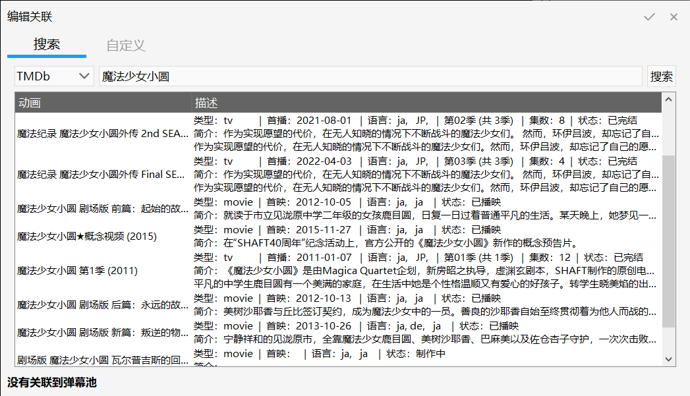

<br/>

使用 脚本`TVmazeList`，你可以得到：

  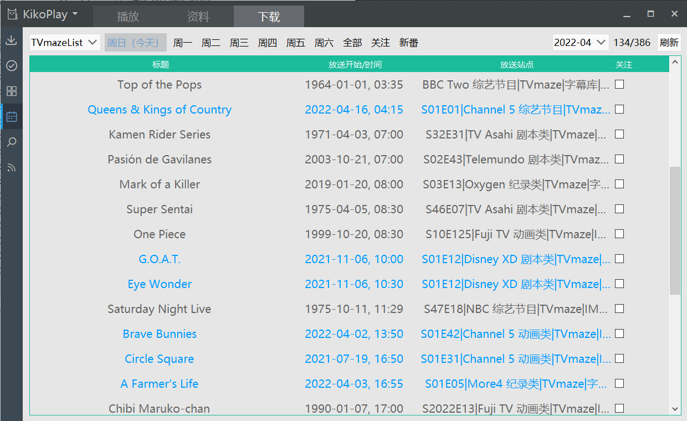

<br/>

> 目录

+ [安装](#安装)
+ [使用](#使用)
+ [Q & A](#q--a)
  + [如何申请TMDb的API密钥?](#如何申请tmdb的api密钥)
  + [如何设置脚本?](#如何设置脚本)
  + [如何搜索媒体数据?](#如何搜索媒体数据)
  + [如何匹配媒体文件?](#如何匹配媒体文件)
  + [如何获取资料夹详细信息?](#如何获取资料夹详细信息)
  + [如何查看某一周的节目单?](#如何查看某一周的节目单)
  + [更多设置项](#更多设置项)
    + [脚本 TMDb 的设置](#脚本-tmdb-的设置)
    + [脚本 TVmaze 的设置](#脚本-tvmaze-的设置)
  + [其他](#其他)
+ [TODO](#todo)
+ [本脚本基于…](#本脚本基于)
  + [TMDb](#tmdb)
  + [TVmaze](#tvmaze)
  + [fanart](#fanart)
  + [Emby](#emby)
  + [KikoPlay](#kikoplay)
    + [KikoPlay脚本仓库](#kikoplay脚本仓库)
+ [反馈](#反馈)

<br/>

## 安装

刮削来自TMDb的数据，你需要：

1. 下载脚本文件。

   + 下载`library`文件夹中的 `tmdb.lua`文件
   + 复制到 KikoPlay 的 资料脚本目录下即可
   + 结果形如 `.\KikoPlay\script\library\tmdb.lua`。

   （假设目录 `.\KikoPlay`为KikoPlay.exe 所在的文件夹）

2. 从你的TMDb账户获取API密钥。

   + 注册或登录你的 TMDb 账户后，
   + 点击页面顶端右上方的头像弹出菜单里的 `账户设置`，点击设置中的`API`页面，申请和获取API密钥。

   （具体方法见下：[如何申请TMDb的API密钥？](#如何申请tmdb的api密钥) ）

3. 把你的API密钥填入脚本设置。

   + 进入KikoPlay，点击左上图标 -> 点击设置脚本设置 -> 在TMDb一行右键 -> 点击设置，
   + 填入你的API密钥。

   （具体方法见下：[如何设置脚本？](#如何设置脚本)）

4. 你可以开始使用啦。

<br/>

查看来自TVmaze的剧集节目单，你需要：

  <!-- *注*：目前(20220305) 番组日历脚本支持且仅支持一个脚本执行，使用 TVmazeList 脚本便不能再使用原本的 bangumi 脚本。-->

1. 下载脚本文件。

   + 下载`bgm_calendar`文件夹中的 `tvmazelist.lua`文件
   + 复制到 KikoPlay 的 番组日历脚本目录下即可
   + 结果形如 `.\KikoPlay\script\bgm_calendar\tvmazelist.lua`。

   （假设目录 `.\KikoPlay`为KikoPlay.exe 所在的文件夹）

    <!-- 2. 移动 `.\KikoPlay\script\bgm_calendar\`文件夹下的其他脚本到别的文件夹下，例如`.\KikoPlay\script\bgm_calendar\backup\`。
    因为目前(20220305) 番组日历脚本支持且仅支持一个脚本执行。要使用原本的 bangumi 脚本，请移除 TVmazeList 脚本，再将原本的脚本放回`.\KikoPlay\script\bgm_calendar\`。-->

2. 你可以开始使用啦。

## 使用

> 适用版本：TMDb 0.2.1.220424_build  |  TVmazeList 0.1.1.220503_build

刮削来自TMDb的数据，你可以：

+ 把播放列表中的媒体文件关联到弹幕池时，使用 TMDb 搜索媒体的标题，选择你想要的并确认。

  1. 打开播放标签页（首页），你在播放列表找到你要搜索的媒体文件，右键->关联->关联弹幕池。
  2. 在弹出窗口的“搜索”下方的选项卡选择 TMDb，输入电影/剧集名称，就能看到搜索到的结果了。
  3. 选中你需要的条目，会进入集数选择的页面，把你的媒体文件与集数信息对应，
  4. 确认无误后点击右上的 √ 。

  （具体方法见下：[如何搜索媒体数据？](#如何搜索媒体数据)）

  电影会显示为一集，剧集为多集。输入剧集标题就好，默认设置部分支持形如"S01"、"第1季"等以空格与标题隔开的剧集季序号，*不指定季序号默认第1季*（，年份等搜索限制条件 这里还不支持）。\(￣▽￣\)  

+ 依据媒体文件名，匹配刮削数据，以自动关联。
  把播放列表中 未关联的媒体文件，自动关联到弹幕池。

  1. 选中播放列表的需要关联的 文件名 任一项或多项 -> 右键 -> 选中 `TMDb`。

  （具体方法见下：[如何匹配媒体文件？](#如何匹配媒体文件)）

+ 在资料库刮削媒体的详细信息。

  1. 打开资料标签页，在资料库找到在你要刮削的媒体资料夹，右键 -> 更新。
   <!-- 2. 在弹出窗口的“番剧搜索”下方的选项卡选择 TMDb，输入电影/剧集名称，就能看到搜索到的结果了。
   （与前一条类似，只输入标题就好。）-->
   <!-- 3. 确认无误后点击右上的 √ 。-->

  （具体方法见下：[如何获取资料夹详细信息？](#如何获取资料夹详细信息)）

+ \* 通过读取Emby的元数据文件，匹配本地媒体文件。

   如果你使用Emby、并按照Emby组织媒体文件夹，那你可以发现Emby在本地媒体文件同文件夹保存的`.nfo`媒体元数据文件（内含.xml格式文本），获取的详细信息就是来自这个文件。
  + 需要更改脚本设置的`匹配 - 数据来源`为`local_Emby_nfo`。
  + 从播放列表选中你的媒体文件（此时显示为文件名），右键 -> 选择`关联` -> 选中最后一行的`TMDb`。

<br/>

查看来自TVmaze的剧集节目单，你可以：

+ 打开下载标签页，点击左侧侧边栏中番组日历的一项(日历形状的图标)，即可查看某一周的节目单(目前仅限GB、US、JP地区)。软件打开时日历时间表为本周。

   未加载成功时，请约10~30秒后再刷新。

+ 在右上方可以选择并查看某一周的节目单。

  最后一行为本周、倒数第二行为下一周，往过去出现几周可以在脚本设置中设定。

  （具体方法见下：[如何查看某一周的节目单？](#如何查看某一周的节目单)）

+ `放送站点`一列，标记了该周播出的某季某集、播出平台及节目类型。显示的节目类型可以在脚本设置中设定。

  右键某行的弹出菜单中，点击TVmaze或季序号集序号，弹出节目或某集的TVmaze页面；点击播放平台及节目类型，弹出媒体主页；点击字幕网站名，弹出搜索节目名称的页面。

## Q & A

> 适用版本：TMDb 0.2.1.220424_build  |  TVmazeList 0.1.1.220503_build

### 如何申请TMDb的API密钥?

1. 打开 [The Movie Database (TMDB) 首页](https://www.themoviedb.org/)，这是一个类似IMDb、豆瓣的媒体数据信息网站，涵盖电影、剧集、演员等。

   
   <br/>

2. 点击页面顶端右侧的 `EN` 修改语言为 `zh-CN`，这样你就可以看到中文页面了。

   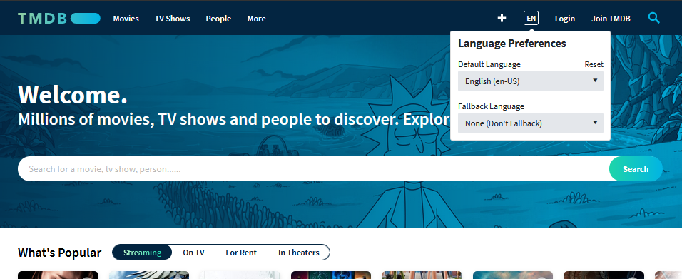
   <br/>

   
   <br/>

3. 你需要一个账户来登录。
   + 没有账户则点击 `注册`，需要一个用户名、一个密码，以及用来验证的电子邮件。
   注册后，登录你刚刚使用的邮箱，查看TMDb发送的验证邮件，确认无误之后验证即可。然后打开登录页面登录。
   
   <br/>
   + 如果你已有账户点击右上的`登录`，需要用户名和密码；

    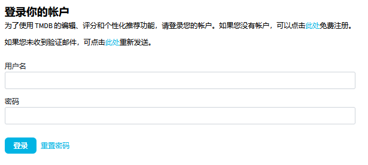
       <br/>

4. 登录后，点击在同样位置的你的头像，在弹出菜单点击账户设置。

   
<br/>

5. 点击默认语言 (default language)，输入/选择 `zh-CN`，界面就是简体中文的了。

   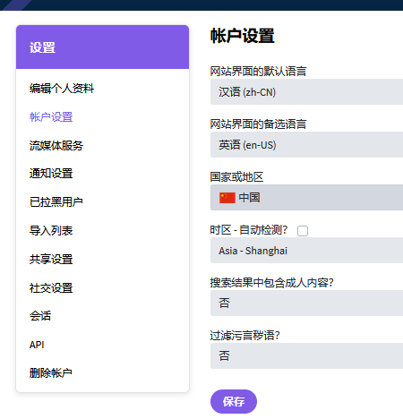
   <br/>

6. 点击左侧边栏的 [API](https://www.themoviedb.org/settings/api)，在新的页面点击申请一个api。 *本图图源自：@ 伪宅中的死宅*

   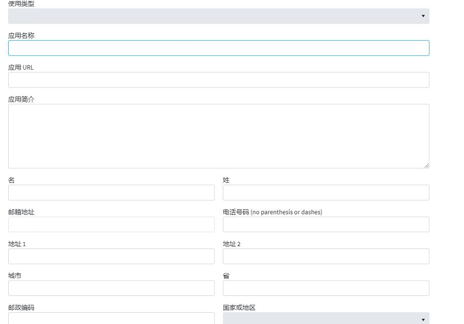
   <br/>

7. 然后把 `API 密钥 (v3 auth)`下的 一串字母数字复制下来，你就得到了你的TMDb的 **API密钥**。
   <br/>

   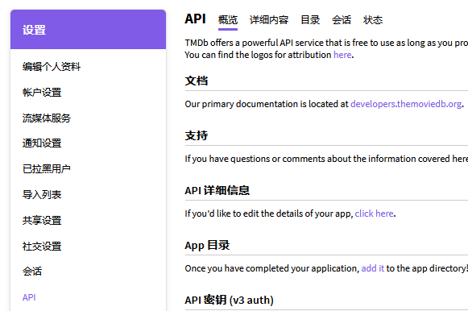
<br/>

8. 选中下方`范例 API 请求`下的链接，并在新标签页打开，会出现了一些奇怪的东西，说明网络能够连接上，否则说明你的网络无法连接到。

   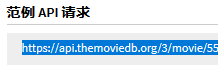

     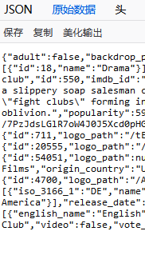
   <br/>

   + 若无法连接到，那么你可能需要修改`hosts`文件，请搜索`Windows 修改 hosts`来了解相关教程。

     > **注意**：`hosts`修改可能**有安全风险**，修改时请**谨慎**，确保安全。

     + 以下是一个添加`hosts` 已经**过时**的 范例，建议你寻找 网址/域名/DNS等的搜索网站搜索`api.themoviedb.org`、`image.tmdb.org`等域名。

     ```bat
     
     # tmdb.org themoviedb Start
     13.249.87.43 www.themoviedb.org
     99.84.173.16 api.themoviedb.org
     99.84.160.76 image.tmdb.org
     51.89.197.177 fanart.tv
     91.134.1.171 webservice.fanart.tv
     163.172.219.181 assets.fanart.tv
     # 172.67.3.215 trakt.tv
     # tmdb.org End
     
     ```

     ​你可以尝试添加 形式像这样的设置，到`hosts`中（例如 其文件末尾）。（` # XXXX `  是注释，无功能，仅起提示作用）
      <br/>

     + **注意**：已经修改过`hosts`了，如果一段时间后发生无法连接的情况，可能是因为服务器间隔几个月后有变更。此时需要重新搜寻合适的网址/域名/DNS，重新更改相关的`hosts`。

<br/>

### 如何设置脚本?

如何设置脚本 tmdb.lua

1. 点击 KikoPlay 左上图标 -> 点击设置；

   
<br/>

2. 点击脚本设置 -> 在TMDb一行右键 -> 点击设置；

   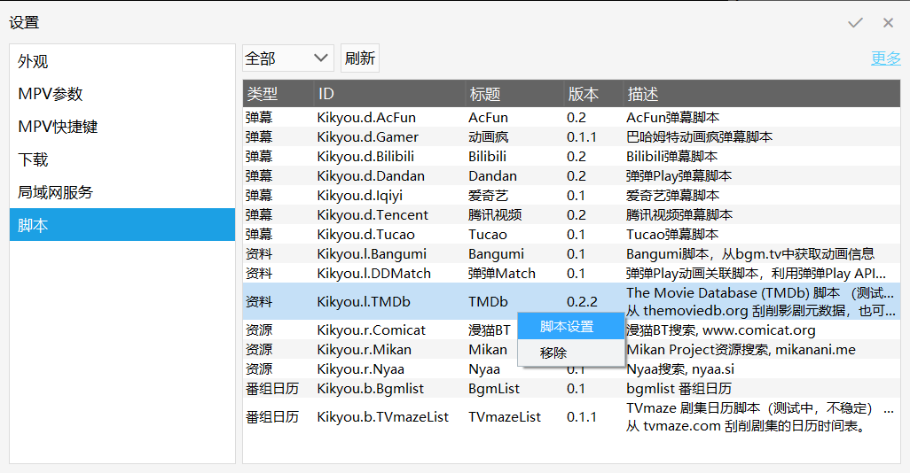
<br/>

3. 在弹出窗口`TMDb API 密钥`那一行的`<<API_Key_Here>>` 处双击 -> 粘贴 上面第7步得到的密钥。其他设置 请根据你的需要选择。

   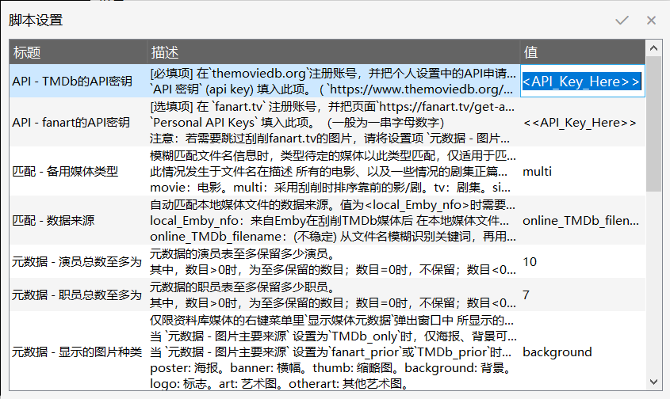
<br/>

其他更多设置项见下：[脚本 TMDb 的设置](#脚本-tmdb-的设置)、[脚本 TVmaze 的设置](#脚本-tvmaze-的设置)

### 如何搜索媒体数据?

在播放列表搜索和刮削媒体

1. 你在播放列表选一个媒体文件，右键->关联->关联弹幕池。

   
<br/>

2. 在弹出窗口的“搜索”下方的选项卡 选 TMDb，输入电影/剧集名称，就能看到搜索到的结果了。

   （输入标题就好，默认设置部分支持形如"S01"、"第1季"等以空格与标题隔开的剧集季序号（，年份等搜索限制条件 这里还不支持）。\(￣▽￣\)  

   
   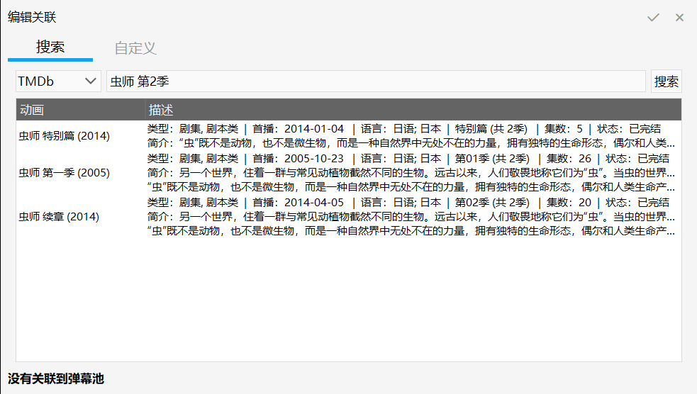
<br/>

3. 选中你需要的条目，会进入集数选择的页面。在分集那一列的选中的一行，先双击、再单击，会弹出集数的列表，选中你需要的，把你的媒体文件与集数信息对应。
   确认无误后点击右上的 √ 。

   （电影会显示为一集，剧集为多集。）

   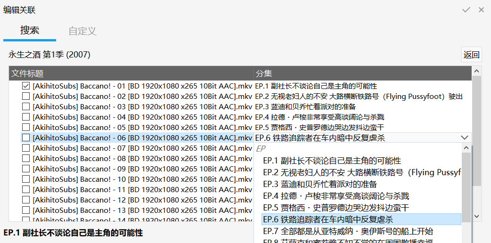
<br/>

### 如何匹配媒体文件?

对于播放列表中 未关联的媒体文件 时：

   1. 选中播放列表的需要关联的 文件名 任一项或多项 -> 右键 -> 选中 TMDb。

对于 拖拽媒体文件 到播放列表时：

   1. 右键播放列表任一项 -> 开启`自动关联模式` ，使其保持显示 √ 的状态。

   2. 右键播放列表任一项 -> 默认关联脚本 -> 选择 TMDb ，使其保持显示 √ 的状态。

   3. 现在拖拽媒体文件到播放列表中时会自动关联了。

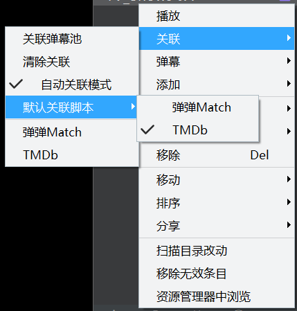
<br/>

### 如何获取资料夹详细信息?

1. 打开资料标签页，在资料库找到在你要刮削的媒体资料夹，右键->更新。
   （也可以在资料库任意处 右键 -> 添加动画，以添加新的媒体资料。）
    *注：资料库与弹幕池无关，请尽量不改动媒体标题*

   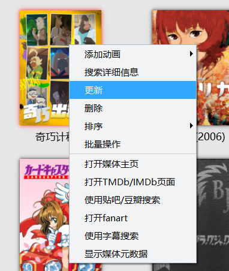

   <!-- <br/>-->
   <!-- 2. 在弹出窗口的“番剧搜索”下方的选项卡选择 TMDb，输入电影/剧集名称，就能看到搜索到的结果了。确认无误后点击右上的 √ 。（输入关键词的方式前者相同）-->
   <!--- 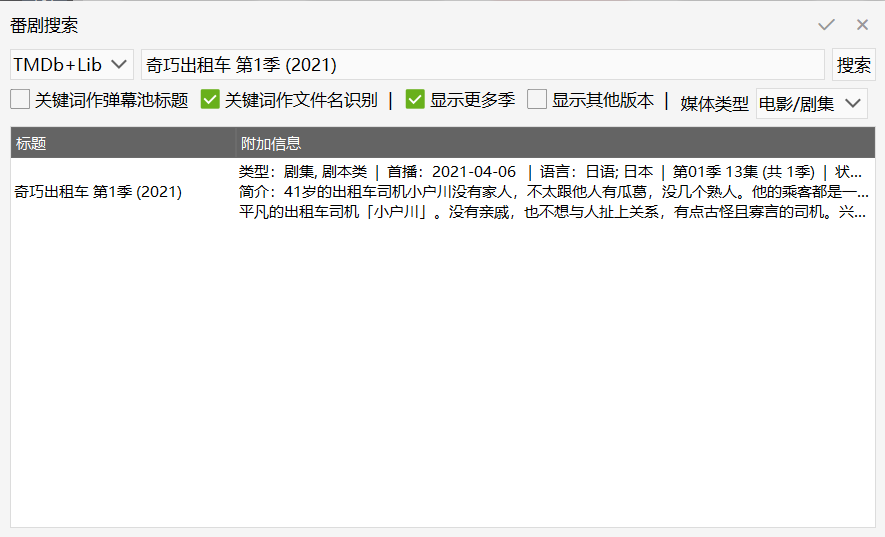 -->

   <br/>

2. 刮削完成后，点击媒体资料夹，你可以看到媒体的资料夹显示 海报图片、剧情简介、类型标签等。

   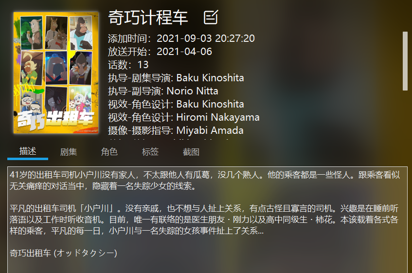
   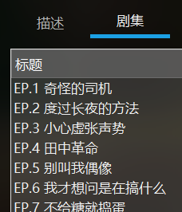  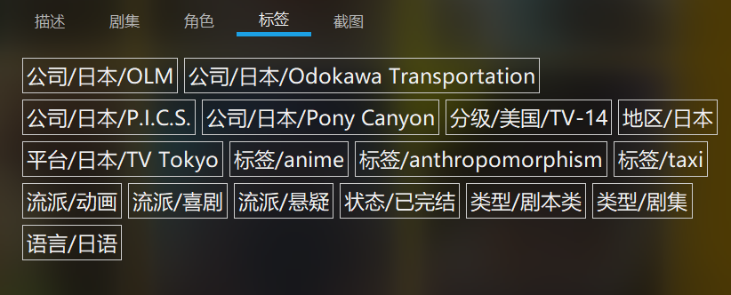

   如果标签等有格式不同，原因可能是此资料是在旧版本搜索、刮削的 与当前不兼容，导致当前更新详细信息时 有部分元数据无法识别。请
   1. 在 步骤1 中选择`搜索详细信息`重新搜索。
   2. 如果 当前资料夹的标题 与 当前TMDb搜索该媒体对应的标题 不符时，退出搜索对话框。在设置 -> 脚本设置 -> TMDb -> 设置 `搜索 - 关键词作标题`为`1`(即使用)，并确认`√`。
   3. 在`搜索详细信息`弹出的对话框中，使用 当前标题 作关键词，选择对应的媒体，并确认`√`。
   4. 如果在刚才的 步骤2.2 更改了设置，请恢复设置；即 把TMDb脚本设置的 `搜索 - 关键词作标题` 改为默认的`0`(即不使用)，并确认`√`。
<br/>

3. 另外，在资料标签页，从资料库找到你要打开链接的媒体资料夹并 右键，你可以看到有多种功能。

   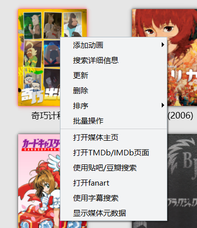
<br/>

   + 可以从你的浏览器弹出媒体对应的页面
     + 媒体主页，IMDb、TMDb，fanart 的媒体页面；
     + 豆瓣、贴吧、字幕网站 搜索媒体标题的页面；

   + 可以弹出对话框，显示媒体的 图片以及详细信息。

    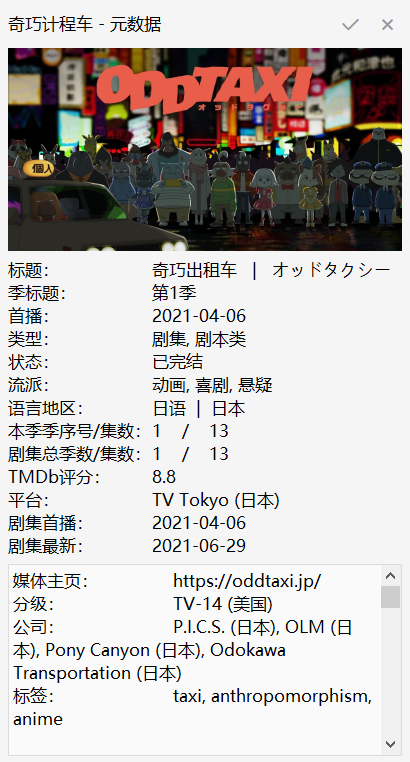

   \* 右键菜单部分功能目前仅限 Windows 系统。
<br/>

### 如何查看某一周的节目单?

查看来自TVmaze的剧集节目单：*（功能不全，暂定）*

+ 打开下载标签页，点击左侧侧边栏中番组日历的一项(日历形状的图标)，即可查看某一周的节目单(目前仅限GB、US、JP地区)。
  第一次打开时显示为本周。

   未加载成功时，请约10~30秒后再刷新。

  
<br/>

+ 在右上方可以选择并查看某一周的节目单。

  + 以周日为一周的第一天，以周日日期代表这一周，名称为形如`YYYY-mm-dd`的年月日。
  + 第一次打开时默认为本周，即待选列表里的最后一行。待选列表依次为 自定义某一周、此前几周、下一周、本周。
  + 点击`自定义星期`，可以指定任意某天的日期来查看其所在周的节目单。
  第一次选择此项或点击`刷新`时，可以在弹出对话框输入形如`YYYY-mm-dd`的年月日，并确认`√`。
  + 未加载成功时，请等待约10\~30秒后刷新。
    更换日历为其他加载过的某一周时，会显示之前得到的该周节目单。
    更换日历为其他未加载过的某一周时，请等待约10~30秒后刷新或操作。

  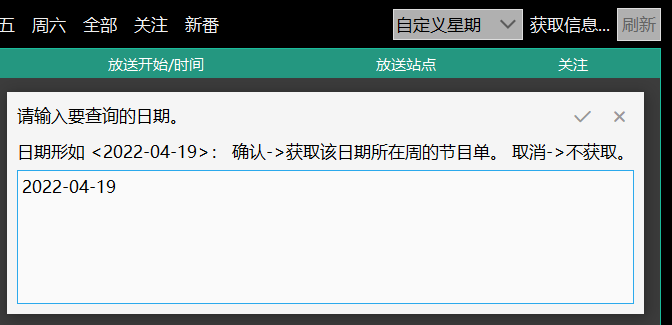
<br/>

  + 分周列表中往过去显示几周，可以在脚本设置中设定，默认近`10`周。

<br/>

### 更多设置项

#### 脚本 TMDb 的设置

> 适用版本：0.2.1.220423_build

API

+ API - TMDb的API密钥

   **\[必填项]** 在`themoviedb.org`注册账号，并把[个人设置中的API](https://www.themoviedb.org/settings/api)申请到的`API 密钥` (api key) 填入此项。一般为一串字母数字

+ API - fanart的API密钥

   \[选填项] 在 `fanart.tv` 注册账号，并把页面`https://fanart.tv/get-an-api-key/`中申请到的`Personal API Keys` 填入此项。（一般为一串字母数字）

  + *注意*：若需要跳过刮削fanart.tv的图片，请将设置项 `元数据 - 图片主要来源` 设为 `TMDb_only`。

  <br/>

搜索

+ 搜索 - 媒体类型

   搜索的数据仅限此媒体类型。

  + `movie`：电影。
  + `multi`：电影/剧集。（默认设置）
  + `tv`：剧集。

+ 搜索 - 关键词处理

   输入的字符经过何种处理作为关键词，来搜索媒体（不含集序号）。

  + `filename`：作为除去拓展名的文件名。（默认设置）
  + `plain`：不处理，作为单纯的标题（搜索请不要输入季序号等）。

+ 搜索 - 关键词作标题

   搜索的关键词是否直接作为媒体的标题。

  + `0`：不使用关键词作为标题 (默认设置)。
  + `1`： 使用关键词作为标题。

   例如可以适用于 ["如何获取资料夹详细信息？" -> 步骤2](#如何获取资料夹详细信息) 中的某一种情景。在媒体资料夹右键菜单点击`搜索媒体信息`获取详细信息时，资料夹的标题 与 此脚本当前版本搜索该媒体对应的标题 不符的情况，这样可以维持资料夹标题不变。

+ 搜索 - 是否显示更多季

   搜索操作中 在没识别到季序号时，是否显示全部季数。
   当且仅当 `搜索 - 关键词处理` 设置为 `filename`时有效。

  + `0`：没识别到季序号时，仅显示第1季、或特别篇。
  + `1`：没识别到季序号时，显示全部季数。（默认设置）

匹配

+ 匹配 - 数据来源

   自动匹配本地媒体文件的数据来源。值为<local_Emby_nfo>时需要用软件Emby提前刮削过。

  + `local_Emby_nfo`：来自Emby在刮削TMDb媒体后 在本地媒体文件同目录存储元数据的 .nfo格式文件(内含.xml格式文本)；
  + `online_TMDb_filename`：从文件名模糊识别关键词，再用TMDb的API刮削元数据 (不够精确)。（默认设置）

+ 匹配 - 备用媒体类型

   模糊匹配文件名信息时，类型待定的媒体以此类型匹配，仅适用于匹配来源为`online_TMDb_filename`的匹配操作。
   此情况发生于文件名在描述 所有的电影、以及一些情况的剧集正篇或特别篇 的时候。
   <!--   other：识别为`其他`类型的集（不同于本篇/特别篇），置于剧集特别篇或电影中。-->

  + `movie`：电影。
  + `multi`：采用刮削时排序靠前的影/剧。（默认设置）
  + `tv`：剧集。
  + `single`：以对话框确定影/剧某一种 (不稳定)。

  <br/>

元数据

+ 元数据 - 刮削媒体元数据

  + 元数据 - 语言

     搜索何种语言的资料作元数据，选择你需要的`语言编码-地区编码`。看着有很多语言，其实大部分都缺乏资料。
     *注意*：再次关联导致标题改变时，弹幕仍然按照旧标题识别，请在`管理弹幕池`中手动复制弹幕池到新标题。

    + `zh-CN`：中文(中国)。（默认设置）
    + `en-US`：English(US)。`es-ES`：español(España)。`fr-FR`：Français(France)。`ja-JP`：日本語(日本)。`ru-RU`：Русский(Россия)。`zh-HK`：中文(香港特區,中國)。`zh-TW`：中文(台灣省，中國)。

  + 元数据 - 标题使用原语言

     元数据的标题是否使用媒体的原语言。
     *注意*：再次关联导致标题改变时，弹幕仍然按照旧标题识别，请在`管理弹幕池`中手动复制弹幕到新标题。

    + `0`：不使用。（默认设置）
    + `1`：使用。

  + 元数据 - 演员总数至多为

     元数据的演员表至多保留多少演员。
     数目为 0 时，不保留；数目 <0 时，保留所有；
     数目为小数时，则向负无穷方向取整。

    + 默认设置 `10`

  + 元数据 - 职员总数至多为

     元数据的职员表至多保留多少职员。
     数目为 0 时，不保留；数目 <0 时，保留所有；
     数目为小数时，则向负无穷方向取整。

    + 默认设置 `7`

  <br/>

+ 元数据 - `显示媒体元数据`功能

  指 资料夹的右键菜单里`显示媒体元数据`功能的相关设置

  + 元数据 - 图片主要来源

     元数据的图片源是使用TMDb还是fanart，需要各自的api密钥。
     其中，fanart的网络连接比较缓慢、图片种类更多 (可完全覆盖TMDb中所有图片种类)。

    + `fanart_prior`：图片优先fanart，(由于fanart的图片种类较多，因此TMDb的图片通常会被忽略)。
    + `TMDb_only`：图片仅TMDb，(不会从fanart刮削图片，仅此项不需要 fanart的API密钥)。（默认设置）
    + `TMDb_prior`：图片优先TMDb，TMDb提供海报、背景，其他的由fanart提供。

  + 元数据 - 图片使用原语言

     元数据中fanart的图片是否使用媒体原语言，仅适用于fanart的图片。TMDb仍参照`元数据 - 语言`中的设置。
     不适用于 `元数据 - 图片主要来源` 设置为`TMDb_only`时，该情况下图片仍优先参照`元数据 - 语言`的语言。
     仅当 `元数据 - 图片主要来源` 设置为`fanart_prior`或`TMDb_prior`时 对fanart的图片有效。

    + `0`：不使用。
    + `1`：使用。（默认设置）

  + 元数据 - 显示的图片种类

    仅限资料夹的右键菜单里`显示媒体元数据`弹出窗口中 所显示的那一张图片的种类。
    当 `元数据 - 图片主要来源` 设置为`TMDb_only`时，仅海报、背景可用。
    当 `元数据 - 图片主要来源` 设置为`fanart_prior`或`TMDb_prior`时，以下均有效（除非图片未刮削到）。

    + `poster`: 海报。
    + `background`: 背景。（默认设置）
    + `banner`: 横幅。`thumb`: 缩略图。`logo`: 标志。`art`: 艺术图。`otherart`: 其他艺术图。

<br/>

#### 脚本 TVmaze 的设置

> 适用版本：0.1.1.220503_build

时间表

+ 时间表 - 剧集类型

  时间表中出现的剧集、节目类型。

  + `scripted`：包含剧本类、动画类、纪录类等剧集 (默认)。
  + `scripted_variety`：包含前者，以及综艺节目、颁奖节目等。
  + `scripted_show`：包含前者，以及游戏节目、真人节目、访谈节目、讨论节目等。
  + `tv_show`：包括前者，以及体育节目、新闻节目等，即所有剧集和节目。

+ 时间表 - 排序

   将每日时间表按此顺序排列。

  + `time`：按时间升序。
  + `timeslot`：按时间档升序。（默认设置）
  + `title`：按名称升序。

分周列表

+ 分周列表 - 近几周

  分周的列表中，显示现在及以前几周。列表倒数第2个为 下一周，最后一个为本周，此二者始终显示。改变设定此项后，请保存脚本设置后重启，方可查看新的分周列表。

  近1周为 `1`(即本周)，近2周为 `2`(即本周、上一周)，以此类推。

  + `0`：自1989-12-17所在一周至今。
  + `10`：近10周 (默认)。",

  *注：* 用 1989-12-17 是因为TVmaze网站日历的默认显示，似乎从这一天开始逐渐有内容，即 The Simpsons S01E01 播出时的那一周。

时间

+ 时间 - 时区小时 / 时区分钟

   使用时区的小时数、分钟数。目前建议使用程序在当前系统的默认时区。
   Asia/Shanghai(亚洲/上海)的时区为`+08:00`，即此处小时数为`+08`、分钟数为`0`。

  + `system`: 系统默认时区的小时数、分钟数。（默认设置）
  + 其他可选小时数: -12 ~ -01， +00， +01 ~ +12
  + 其他可选分钟数: 0 ~ 59

### 其他

两个分支 \(branches\)

+ 分支 `library-tmdb-pr`： *fork 自* [KikoPlay脚本仓库](https://github.com/KikoPlayProject/KikoPlayScript) ，并用于 pull request。
+ 分支 `library-tmdb-beta`： 用于展示 KikoPlay脚本TMDb 的最新进展、使用方法等。

> 脚本 TMDb 及 TVmazeList 均包含在内，（请忽略开发前期时缺乏前瞻性的命名 QAQ）

<br/>
查看 脚本TMDb 的 [更新日志](CHANGELOG.md)

<br/>

## TODO

+ [x]  关联刮削数据（以本地文件路径/文件名、依赖TMDb的API）；

+ [x]  刮削电影/剧集的参演演员信息；

   ~~\* 偶然发现 TMDb里剧集的默认演员表是全季共用的，且更贴合最后一季，而非全剧主要角色；职员表主要为导演/单集导演，少见其他职员。~~

+ [ ]  资料库右键菜单添加 显示媒体元数据 的功能；

+ [ ] ~~不记得是什么了，但是感觉好像少了什么；~~

+ [ ]  ...

<!--### 其他
电影偷懒就没再加上。
剧集tmdb默认演员表好像会侧重后播出的剧集，也没用这个。
本地.nfo的match加了，不过没出现在库里-->

<br/>

## 本脚本基于…

### TMDb

> 本脚本借助 [TMDb](https://www.themoviedb.org/) 的 API 刮削信息。

The Movie Database (TMDB) is a community built movie and TV database.

Every piece of data has been added by our amazing community dating back to 2008. TMDb's strong international focus and breadth of data is largely unmatched and something we're incredibly proud of. Put simply, we live and breathe community and that's precisely what makes us different.


+ tmdb首页  -   [https://www.themoviedb.org/](https://www.themoviedb.org/)
+ 个人设置 -   [https://www.themoviedb.org/settings/account](https://www.themoviedb.org/settings/account)
+ 个人设置-申请 API  -   [https://www.themoviedb.org/settings/api](https://www.themoviedb.org/settings/api)
+ API 开发用手册  -   [https://developers.themoviedb.org/3/getting-started/introduction](https://developers.themoviedb.org/3/getting-started/introduction)
<br/>

### TVmaze

> 本脚本借助 [TVmaze](https://www.tvmaze.com/) 的 公共API 刮削剧集的日历时间表。
>  
> 本节内容来自 [TVmaze](https://www.tvmaze.com/)

Say hi to your new TVguide. Never miss a show again!

Find episode information for any show on any device. anytime, anywhere!


<br/>

### fanart

> 本脚本借助 [fanart](https://fanart.tv/) 的 API 刮削媒体图片。
>  
> 本节内容来自 [fanart](https://fanart.tv/)

Logos, Backgrounds, Posters and more for your TV, Movie and Music collections.


<br/>

### Emby

> 基于Emby的本地匹配功能，是通过 Emby 对本地媒体资料库的本地元数据缓存 .nfo文件内的 .xml 格式文本 来匹配关联本地媒体文件的。
>  
> 本节内容来自 [Emby](https://emby.media/)

[Emby](https://emby.media/) - Your personal media on any device

Bringing all of your home videos, music, and photos together into one place has never been easier. Your personal Emby Server automatically converts and streams your media on-the-fly to play on any device.


<br/>

### KikoPlay

> 本脚本是用于弹幕视频播放器 [KikoPlay](https://github.com/KikoPlayProject/KikoPlay) 的资料脚本。

[KikoPlay](https://github.com/KikoPlayProject/KikoPlay) - 不仅仅是全功能弹幕播放器


<br/>

#### KikoPlay脚本仓库

> 本脚本的基本功能框架基于 [KikoPlay 脚本仓库](https://github.com/KikoPlayProject/KikoPlayScript) 的脚本。
>  
> 本节内容来自 [/KikoPlayProject/KikoPlayScript](https://github.com/KikoPlayProject/KikoPlayScript)

这里是 [KikoPlay](https://github.com/KikoPlayProject/KikoPlay) 的 [脚本仓库](https://github.com/KikoPlayProject/KikoPlayScript)  
KikoPlay支持Lua脚本，有三种类型：

+ 弹幕脚本： 位于script/danmu目录下，提供弹幕搜索、下载、发送弹幕等功能
+ 资料脚本：位于script/library目录下，提供动画（或者其他类型的条目）搜索、详细信息获取、分集信息获取、标签获取、自动关联等功能
+ 资源脚本：位于script/resource目录下，提供资源搜索功能

关于脚本开发的详细内容，请参考[KikoPlay脚本开发参考](reference.md)
<br/>

## 反馈

> 本节内容来自 `/KikoPlayProject/KikoPlayScript`

有新脚本可直接向 [`/KikoPlayProject/KikoPlayScript`](https://github.com/KikoPlayProject/KikoPlayScript) 提交PR。

如果有`/KikoPlayProject/KikoPlayScript`的相关问题，创建issue、或者到QQ群874761809反馈。
s