#  tmdb.lua - 使用手册

脚本 `tmdb.lua` 是用于视频软件 `KikoPlay` 的资料脚本，主要借助你从 `TMDb` 申请的API来搜索和刮削信息。

脚本~~仍在惰性地几乎~~没有编写中，希望大家多多发现Bug帮助完善脚本 : )


- [tmdb.lua - 使用手册](#tmdblua---使用手册)
  - [使用方法](#使用方法)
    - [如何从TMDb申请API密钥](#如何从tmdb申请api密钥)
    - [将脚本`tmdb.lua`载入`KikoPlay`](#将脚本tmdblua载入kikoplay)
    - [TODO：](#todo)
    - [其他](#其他)
  - [刮削数据 来自于  TMDb](#刮削数据-来自于--tmdb)


## 使用方法

刮削来自TMDb的数据，你需要：

1. 下载脚本文件。

   下载`library`文件夹中的 `tmdb.lua`文件，复制到 KikoPlay 的 资料脚本目录下即可，结果形如 `.\KikoPlay\script\library\tmdb.lua`。

   （假设目录 `.\KikoPlay`为KikoPlay.exe 所在的文件夹）

2. 从你的TMDb账户获取API密钥。

   注册或登录你的 TMDb 账户，点击页面顶端右上方的头像弹出菜单里的 `账户设置`，点击设置中的`API`页面，申请和获取API密钥。（具体方法见下：[如何从TMDb申请API密钥](#%E5%A6%82%E4%BD%95%E4%BB%8Etmdb%E7%94%B3%E8%AF%B7api%E5%AF%86%E9%92%A5) ）

3. 把API密钥填入脚本设置。

   你在播放列表选一个媒体文件，右键->关联->关联弹幕池。在弹出窗口的“搜索”下方的选项卡 选 TMDb，输入电影/剧集名称，就能看到搜索到的结果了。
   
   （输入标题就好，因为年份/第几季之类的 这里还不支持。\￣▽￣\  ）

### 如何从TMDb申请API密钥

1. 打开 [The Movie Database (TMDB) 首页](https://www.themoviedb.org/)，这是一个类似IMDb、豆瓣的媒体数据信息网站，涵盖电影、剧集、演员等。

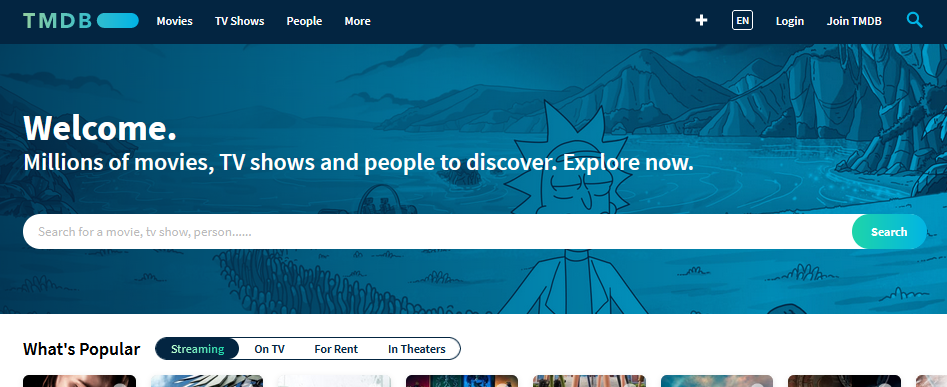
   <br/>
   
2. 点击页面顶端右侧的 `EN` 修改语言为 `zh-CN`，这样你就可以看到中文页面了。
   

   <br/>
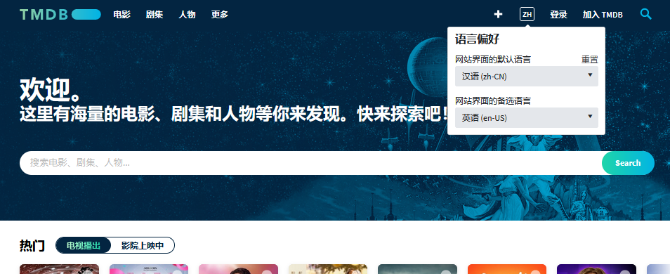
   <br/>
   
3. 你需要一个账户来登录。
   + 没有账户则点击 `注册`，需要一个用户名、一个密码，以及用来验证的电子邮件。
   注册后，登录你刚刚使用的邮箱，查看TMDb发送的验证邮件，确认无误之后验证即可。然后打开登录页面登录。
   + 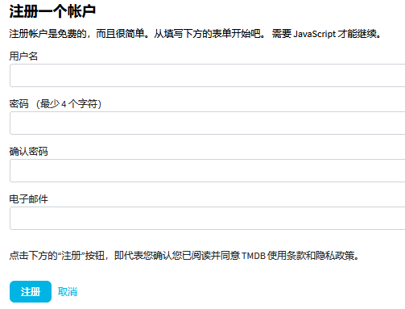
   <br/>
  + 如果你已有账户点击右上的`登录`，需要用户名和密码；

    
       <br/>

4. 登录后，点击在同样位置的你的头像，在弹出菜单点击账户设置。

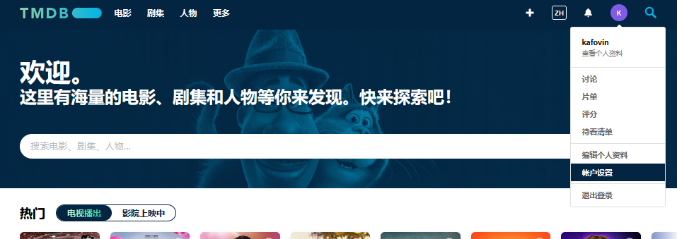
<br/>

5. 点击默认语言 (default language)，输入/选择 `zh-CN`，界面就是简体中文的了。

   
   <br/>

6. 点击左侧边栏的 [API](https://www.themoviedb.org/settings/api)，在新的页面点击申请一个api。本图图源自：@ 伪宅中的死宅

   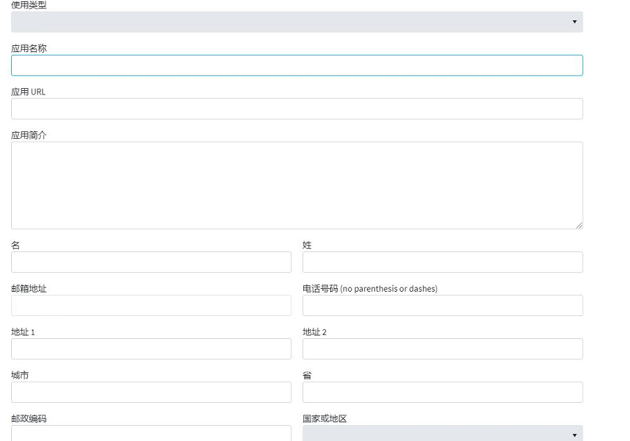
   <br/>

7. 然后把 `API 密钥 (v3 auth)`下的 一串字母数字复制下来，你就得到了你的TMDb的 **API密钥**。
   <br/>


<br/>

8. 选中下方`范例 API 请求`下的链接，并在新标签页打开，会出现了一些奇怪的东西，说明网络能够连接上，否则说明你的网络无法连接到。

   

   
   <br/>

   

   + 若无法连接到，那么你可能需要修改`hosts`文件，请搜索`Windows 修改 hosts`来了解相关教程。

     > **注意**：`hosts`修改可能**有安全风险**，修改时请**谨慎**，确保安全。

     + 以下是一个添加`hosts`的可能已经过时范例，建议你寻找 网址/域名/DNS等的搜索网站搜索`api.themoviedb.org`、`image.tmdb.org`等域名。

     ```bat
     
     # tmdb.org themoviedb Start
     # 52.216.89.219 tmdb.org
     52.85.79.4 image.tmdb.org
     # 104.16.57.155 files.tmdb.org
     # 52.85.79.2 themoviedb.org
     # 143.204.147.7 www.themoviedb.org
     99.84.173.22 api.themoviedb.org
     # 104.26.12.126 fanart.tv
     # 163.172.219.181 assets.fanart.tv
     # 104.20.81.229 trakt.tv
     # tmdb.org End
     
     ```

     ​		你可以尝试添加 形式像这样的设置，到`hosts`中（例如 其文件末尾）。（` # XXXX `  是注释，无功能，仅起提示作用）
      <br/>
     
     + **注意**：已经修改过`hosts`了，如果一段时间后发生无法连接的情况，可能是因为服务器间隔几个月后有变更。此时需要重新搜寻合适的网址/域名/DNS，重新更改相关的`hosts`。

   

### 将脚本`tmdb.lua`载入`KikoPlay`

   

1. 点击 KikoPlay 左上图标 -> 点击设置；

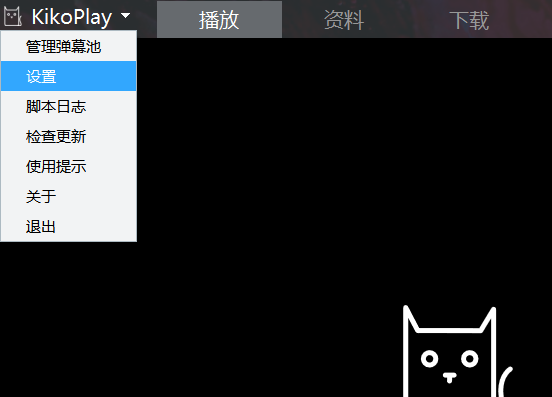
<br/>

2. 点击脚本设置 -> 在TMDb一行右键 -> 点击设置；

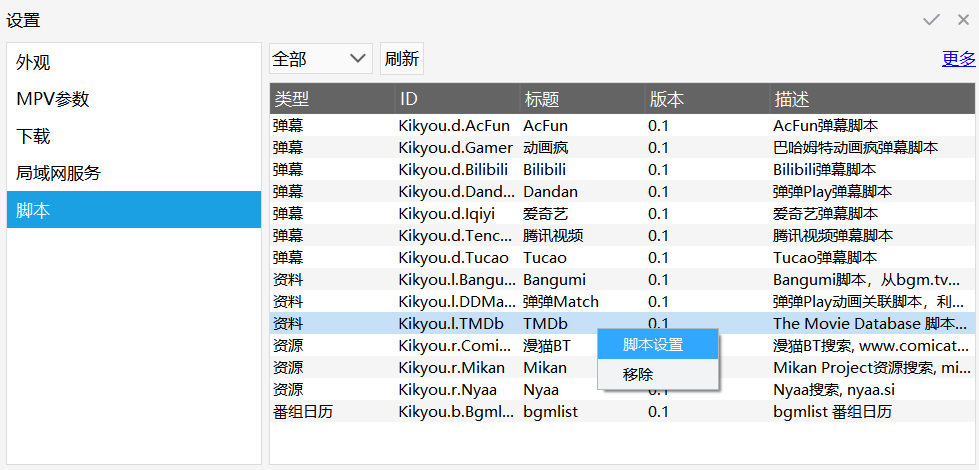
<br/> 

3. 在弹出窗口`TMDb API 密钥`那一行的`<<API_Key_Here>>` 处双击 -> 粘贴 上面第7步得到的密钥。

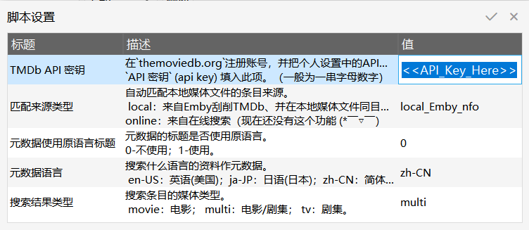
<br/>

4. 你在播放列表选一个媒体文件，右键->关联->关联弹幕池。

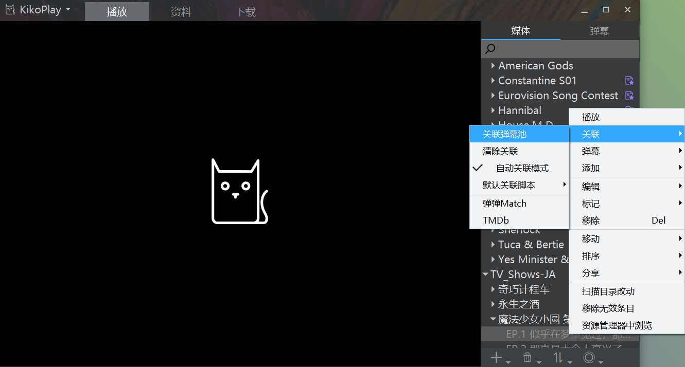
<br/>

5. 在弹出窗口的“搜索”下方的选项卡 选 TMDb，输入电影/剧集名称，就能看到搜索到的结果了。

   （输入标题就好，因为年份/第几季之类的 这里还不支持。￣▽￣  ）

   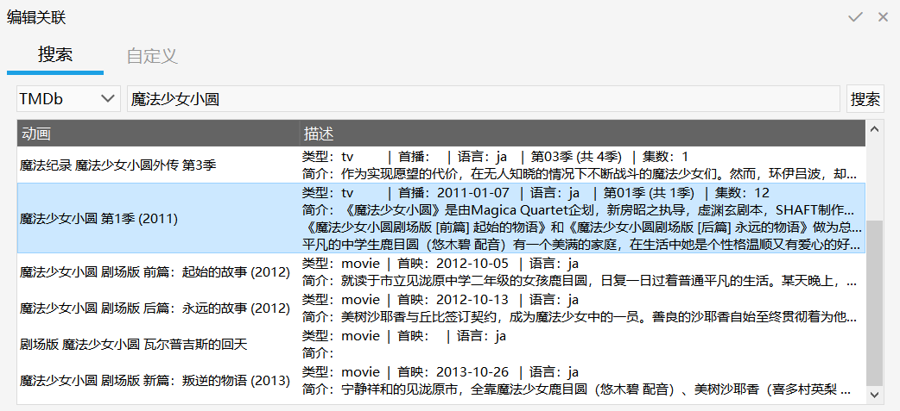
<br/>

6. 选中你需要的条目，会进入集数选择的页面。在分集那一列的选中的一行，先双击、再单击，会弹出集数的列表，选中你需要的。

   （电影会显示为一集，剧集为多级。）

   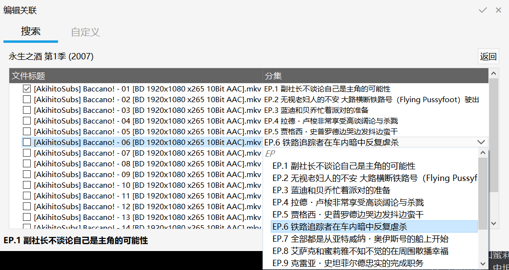
<br/>

### TODO：

+ [ ]  刮削电影/剧集的参演演员信息；
+ [ ]  关联刮削数据（以本地文件路径）；

+ [ ]  ...

<!--### 其他
电影偷懒就没再加上。
剧集tmdb默认演员表好像会侧重后播出的剧集，也没用这个。
本地.nfo的match加了，不过没出现在库里-->

## 刮削数据 来自于  TMDb

本脚本借助 TMDb 的 API 刮削信息。


+ tmdb首页  -   [https://www.themoviedb.org/](https://www.themoviedb.org/)
+ 个人设置 -   [https://www.themoviedb.org/settings/account](https://www.themoviedb.org/settings/account)
+ 个人设置-申请 API  -   [https://www.themoviedb.org/settings/api](https://www.themoviedb.org/settings/api)
+ API 开发用手册  -   [https://developers.themoviedb.org/3/getting-started/introduction](https://developers.themoviedb.org/3/getting-started/introduction)


## KikoPlay脚本仓库


这里是KikoPlay的脚本仓库  
KikoPlay支持Lua脚本，有三种类型：

 - 弹幕脚本： 位于script/danmu目录下，提供弹幕搜索、下载、发送弹幕等功能
 - 资料脚本：位于script/library目录下，提供动画（或者其他类型的条目）搜索、详细信息获取、分集信息获取、标签获取、自动关联等功能
 - 资源脚本：位于script/resource目录下，提供资源搜索功能

关于脚本开发的详细内容，请参考[KikoPlay脚本开发参考](reference.md)

### 反馈

有新脚本可直接提交PR

如果有问题，创建issue或者联系我:
dx_8820832#yeah.net（#→@），或者到QQ群874761809反馈
