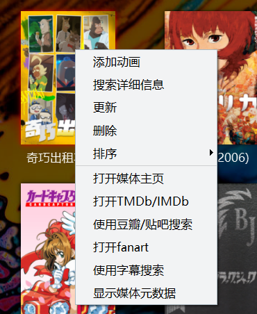

# KikoPlay 脚本 TMDb & TVmaze - 使用手册

脚本 TMDb (`/library/tmdb.lua`) 是用于弹幕视频播放软件  [KikoPlay](https://github.com/KikoPlayProject/KikoPlay) 的资料脚本，主要借助你从 [The Movie Database (TMDB)](https://www.themoviedb.org/) 申请的API来搜索和刮削信息。
也可设置选择刮削 [fanart](https://fanart.tv/) 的媒体图片、[Emby](https://emby.media/) 的本地元数据。

脚本 TVmaze (`/bgm_calendar/tvmazelist.lua`) 是针对剧集的日历时间表脚本（仅英国、美国），主要借助从 [TVmaze](https://www.tvmaze.com/) 的公共API刮削剧集的日历时间表。

脚本~~仍在惰性地几乎~~没有编写中，希望大家多多发现Bug帮助完善脚本 : )


<br/>

使用KikoPlay脚本`TMDb`，你可以得到：

  

<br/>

> 目录

+ [KikoPlay 脚本 TMDb & TVmaze - 使用手册](#kikoplay-脚本-tmdb--tvmaze---使用手册)
  + [安装](#安装)
  + [使用](#使用)
  + [Q & A](#q--a)
    + [如何从TMDb申请API密钥](#如何从tmdb申请api密钥)
    + [如何设置脚本 tmdb.lua](#如何设置脚本-tmdblua)
    + [如何搜索、刮削媒体数据？](#如何搜索刮削媒体数据)
    + [其他](#其他)
  + [TODO：](#todo)
  + [本脚本基于...](#本脚本基于)
    + [TMDb](#tmdb)
    + [TVmaze](#tvmaze)
    + [fanart](#fanart)
    + [Emby](#emby)
    + [KikoPlay](#kikoplay)
      + [KikoPlay脚本仓库](#kikoplay脚本仓库)
      + [反馈](#反馈)

<br\>

## 安装

刮削来自TMDb的数据，你需要：

1. 下载脚本文件。

   + 下载`library`文件夹中的 `tmdb.lua`文件
   + 复制到 KikoPlay 的 资料脚本目录下即可
   + 结果形如 `.\KikoPlay\script\library\tmdb.lua`。

   （假设目录 `.\KikoPlay`为KikoPlay.exe 所在的文件夹）

2. 从你的TMDb账户获取API密钥。

   +  注册或登录你的 TMDb 账户后，
   +  点击页面顶端右上方的头像弹出菜单里的 `账户设置`，点击设置中的`API`页面，申请和获取API密钥。
   
   （具体方法见下：[如何从TMDb申请API密钥](#如何从tmdb申请api密钥) ）

3. 把你的API密钥填入脚本设置。

   + 进入KikoPlay，点击左上图标 -> 点击设置脚本设置 -> 在TMDb一行右键 -> 点击设置，
   + 填入你的API密钥。
   
   （具体方法见下：[如何设置脚本 tmdb.lua](#如何设置脚本-tmdblua)）

4. 你可以开始使用啦。

## 使用

1. 把媒体文件关联到弹幕池时，使用 TMDb 搜索媒体的标题，选择你想要的并确认。

   + 打开播放标签页（首页），你在播放列表找到你要搜索的媒体文件，右键->关联->关联弹幕池。
   + 在弹出窗口的“搜索”下方的选项卡选择 TMDb，输入电影/剧集名称，就能看到搜索到的结果了。
   + 选中你需要的条目，会进入集数选择的页面，把你的媒体文件与集数信息对应，
   + 确认无误后点击右上的 √ 。

   （具体方法见下：[如何搜索、刮削媒体数据？](#如何搜索刮削媒体数据)）

   电影会显示为一集，剧集为多集。输入标题就好，因为年份/第几季之类的 这里还不支持。\￣▽￣\  

2. 在资料库刮削媒体的详细信息。

   + 打开资料标签页，在资料库找到在你要刮削的媒体资料夹，右键->搜索详细信息。 
   + 在弹出窗口的“番剧搜索”下方的选项卡选择 TMDb，输入电影/剧集名称，就能看到搜索到的结果了。
   （与前一条类似，只输入标题就好。）
   + 确认无误后点击右上的 √ 。

3. \* 通过读取Emby的元数据文件，匹配本地媒体文件。
   
   如果你使用Emby、并按照Emby组织媒体文件夹，那你可以发现Emby在本地媒体文件同文件夹保存的`.nfo`媒体元数据文件（内含.xml格式文本），获取的详细信息就是来自这个文件。
   + 从播放列表选中你的媒体文件（此时显示为文件名），右键 -> 选择`关联` -> 选中最后一行的`TMDb`。

## Q & A
### 如何从TMDb申请API密钥

1. 打开 [The Movie Database (TMDB) 首页](https://www.themoviedb.org/)，这是一个类似IMDb、豆瓣的媒体数据信息网站，涵盖电影、剧集、演员等。

   
   <br/>
   
2. 点击页面顶端右侧的 `EN` 修改语言为 `zh-CN`，这样你就可以看到中文页面了。
   
   
   <br/>
   
   <br/>
   
3. 你需要一个账户来登录。
   + 没有账户则点击 `注册`，需要一个用户名、一个密码，以及用来验证的电子邮件。
   注册后，登录你刚刚使用的邮箱，查看TMDb发送的验证邮件，确认无误之后验证即可。然后打开登录页面登录。
   + 
   <br/>
  + 如果你已有账户点击右上的`登录`，需要用户名和密码；

    
       <br/>

4. 登录后，点击在同样位置的你的头像，在弹出菜单点击账户设置。


<br/>

5. 点击默认语言 (default language)，输入/选择 `zh-CN`，界面就是简体中文的了。

   
   <br/>

6. 点击左侧边栏的 [API](https://www.themoviedb.org/settings/api)，在新的页面点击申请一个api。本图图源自：@ 伪宅中的死宅

   
   <br/>

7. 然后把 `API 密钥 (v3 auth)`下的 一串字母数字复制下来，你就得到了你的TMDb的 **API密钥**。
   <br/>


<br/>

8. 选中下方`范例 API 请求`下的链接，并在新标签页打开，会出现了一些奇怪的东西，说明网络能够连接上，否则说明你的网络无法连接到。

   

     
   <br/>

   

   + 若无法连接到，那么你可能需要修改`hosts`文件，请搜索`Windows 修改 hosts`来了解相关教程。

     > **注意**：`hosts`修改可能**有安全风险**，修改时请**谨慎**，确保安全。

     + 以下是一个添加`hosts` 已经**过时**的 范例，建议你寻找 网址/域名/DNS等的搜索网站搜索`api.themoviedb.org`、`image.tmdb.org`等域名。

     ```bat
     
     # tmdb.org themoviedb Start
     13.249.87.43 www.themoviedb.org
     99.84.173.16 api.themoviedb.org
     99.84.160.76 image.tmdb.org
     51.89.197.177 fanart.tv
     91.134.1.171 webservice.fanart.tv
     163.172.219.181 assets.fanart.tv
     # 172.67.3.215 trakt.tv
     # tmdb.org End
     
     ```

     ​		你可以尝试添加 形式像这样的设置，到`hosts`中（例如 其文件末尾）。（` # XXXX `  是注释，无功能，仅起提示作用）
      <br/>
     
     + **注意**：已经修改过`hosts`了，如果一段时间后发生无法连接的情况，可能是因为服务器间隔几个月后有变更。此时需要重新搜寻合适的网址/域名/DNS，重新更改相关的`hosts`。

   

### 如何设置脚本 tmdb.lua

   

1. 点击 KikoPlay 左上图标 -> 点击设置；


<br/>

2. 点击脚本设置 -> 在TMDb一行右键 -> 点击设置；


<br/> 

3. 在弹出窗口`TMDb API 密钥`那一行的`<<API_Key_Here>>` 处双击 -> 粘贴 上面第7步得到的密钥。其他设置 请根据你的需要选择。


<br/>

### 如何搜索、刮削媒体数据？

1. 你在播放列表选一个媒体文件，右键->关联->关联弹幕池。


<br/>

2. 在弹出窗口的“搜索”下方的选项卡 选 TMDb，输入电影/剧集名称，就能看到搜索到的结果了。

   （输入标题就好，因为年份/第几季之类的 这里还不支持。\￣▽￣\  ）

   
<br/>

3. 选中你需要的条目，会进入集数选择的页面。在分集那一列的选中的一行，先双击、再单击，会弹出集数的列表，选中你需要的，把你的媒体文件与集数信息对应。
   确认无误后点击右上的 √ 。

   （电影会显示为一集，剧集为多级。）

   
<br/>

4. 打开资料标签页，在资料库找到在你要刮削的媒体资料夹，右键->搜索详细信息。

   

5. 在弹出窗口的“番剧搜索”下方的选项卡选择 TMDb，输入电影/剧集名称，就能看到搜索到的结果了。确认无误后点击右上的 √ 。

   

   （同样，搜索时只输入标题就好。）
6. 刮削完成后，你可以看到媒体的资料夹显示 海报图片、剧情简介、类型标签等。
   
   
    

7. 另外，你可以快捷地打开媒体的TMDb的网页。
   在资料标签页，从资料库找到你要打开链接的媒体资料夹，右键->打开TMDb页面，就会从你的浏览器弹出媒体对应的TMDb页面。

   

### 其他

两个分支 \(branches\)

+ 分支 `library-tmdb-pr`： *fork 自* [KikoPlay脚本仓库](https://github.com/KikoPlayProject/KikoPlayScript) ，并用于 pull request。
+ 分支 `library-tmdb-beta`： 用于展示 KikoPlay脚本TMDb 的最新进展、使用方法等。

<br/>

查看 脚本TMDb 的 [更新日志](CHANGELOG.md)

<br/>

## TODO：

+ [ ]  关联刮削数据（以本地文件路径/文件名、依赖TMDb的API）；

+ [ ]  刮削电影/剧集的参演演员信息；
   
   ~~\* 偶然发现 TMDb里剧集的默认演员表是全季共用的，且更贴合最后一季，而非全剧主要角色；职员表主要为导演/单集导演，少见其他职员。~~

+ [ ]  资料库右键菜单添加 显示媒体元数据 的功能；

+ [ ]  ...

<!--### 其他
电影偷懒就没再加上。
剧集tmdb默认演员表好像会侧重后播出的剧集，也没用这个。
本地.nfo的match加了，不过没出现在库里-->


## 本脚本基于...
###  TMDb

> 本脚本借助 [TMDb](https://www.themoviedb.org/) 的 API 刮削信息。

The Movie Database (TMDB) is a community built movie and TV database. 

Every piece of data has been added by our amazing community dating back to 2008. TMDb's strong international focus and breadth of data is largely unmatched and something we're incredibly proud of. Put simply, we live and breathe community and that's precisely what makes us different.


+ tmdb首页  -   [https://www.themoviedb.org/](https://www.themoviedb.org/)
+ 个人设置 -   [https://www.themoviedb.org/settings/account](https://www.themoviedb.org/settings/account)
+ 个人设置-申请 API  -   [https://www.themoviedb.org/settings/api](https://www.themoviedb.org/settings/api)
+ API 开发用手册  -   [https://developers.themoviedb.org/3/getting-started/introduction](https://developers.themoviedb.org/3/getting-started/introduction)

### TVmaze

> 本脚本借助 [TVmaze](https://www.tvmaze.com/) 的 公共API 刮削剧集的日历时间表。
> 
> 本节内容来自 [TVmaze](https://www.tvmaze.com/)

Say hi to your new TVguide. Never miss a show again!

Find episode information for any show on any device. anytime, anywhere!


### fanart

> 本脚本借助 [fanart](https://fanart.tv/) 的 API 刮削媒体图片。
> 
> 本节内容来自 [fanart](https://fanart.tv/)

Logos, Backgrounds, Posters and more for your TV, Movie and Music collections.


### Emby

> 基于Emby的本地匹配功能，是通过 Emby 对本地媒体资料库的本地元数据缓存 .nfo文件内的 .xml 格式文本 来匹配关联本地媒体文件的。
> 
> 本节内容来自 [Emby](https://emby.media/)

[Emby](https://emby.media/) - Your personal media on any device

Bringing all of your home videos, music, and photos together into one place has never been easier. Your personal Emby Server automatically converts and streams your media on-the-fly to play on any device.


### KikoPlay

> 本脚本是用于弹幕视频播放器 [KikoPlay](https://github.com/KikoPlayProject/KikoPlay) 的资料脚本。

[KikoPlay](https://github.com/KikoPlayProject/KikoPlay - 不仅仅是全功能弹幕播放器


#### KikoPlay脚本仓库

> 本脚本的基本功能框架基于 [KikoPlay 脚本仓库](https://github.com/KikoPlayProject/KikoPlayScript) 的脚本。
> 
> 本节内容来自 [/KikoPlayProject/KikoPlayScript](https://github.com/KikoPlayProject/KikoPlayScript) 

这里是 [KikoPlay](https://github.com/KikoPlayProject/KikoPlay) 的 [脚本仓库](https://github.com/KikoPlayProject/KikoPlayScript)  
KikoPlay支持Lua脚本，有三种类型：

 - 弹幕脚本： 位于script/danmu目录下，提供弹幕搜索、下载、发送弹幕等功能
 - 资料脚本：位于script/library目录下，提供动画（或者其他类型的条目）搜索、详细信息获取、分集信息获取、标签获取、自动关联等功能
 - 资源脚本：位于script/resource目录下，提供资源搜索功能

关于脚本开发的详细内容，请参考[KikoPlay脚本开发参考](reference.md)

#### 反馈

> 本节内容来自 `/KikoPlayProject/KikoPlayScript`

有新脚本可直接向 [`/KikoPlayProject/KikoPlayScript`](https://github.com/KikoPlayProject/KikoPlayScript) 提交PR。

如果有`/KikoPlayProject/KikoPlayScript`的相关问题，创建issue、或者到QQ群874761809反馈。
